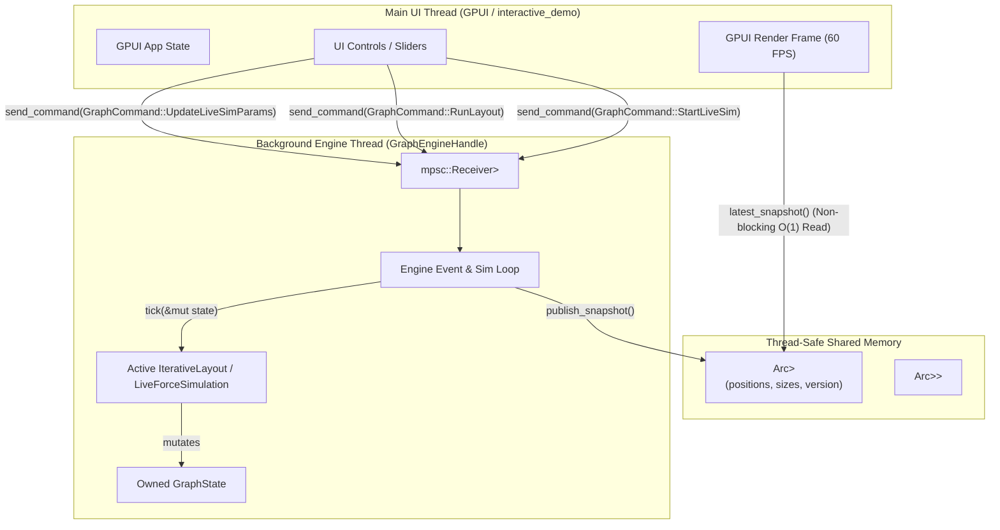

# Refactored Architecture Plan: Asynchronous, Tunable Layout Engine for `graphene-rs`

## Goal Description
This plan updates the phased refactor roadmap to port `graphene-rs` from synchronous/static layout computations to a fully tunable, asynchronous background layout engine with high-performance GPUI integration.

The updated plan directly aligns with the **existing `graphene-rs` architecture**:
- Uses **`graphene_core::GraphState<S>`** with Structure-of-Arrays (SoA) layout.
- Extends the existing **`GraphEngineHandle<S>`** (`crates/graphene_layout/src/engine.rs`) and **`GraphCommand<S>`** asynchronous command queue.
- Replaces raw channel event loops for rendering with zero-allocation, lock-free **`Arc<RwLock<RenderSnapshot>>`** double-buffering.
- Preserves **`Layout<S>`** (`fn compute(&mut self, state: &mut GraphState<S>)`) for static/one-shot layout algorithms (Sugiyama, FCose, Circle, Grid) while introducing **`IterativeLayout<S>`** and enhancing **`LiveForceSimulation`** for frame-by-frame physics ticking.
- Integrates hot-swappable parameter updates into **`LiveForceSimulation`** via **`GraphCommand::UpdateLiveSimParams`**.
- Binds controls to GPUI in **`examples/src/bin/interactive_demo`** and **`graphene_gpui`**.

---

## Architecture Overview



---

## User Review Required

> [!IMPORTANT]
> **Static vs Iterative Layout Trait Boundary**:
> Static algorithms (e.g. `SugiyamaLayout`, `FCoseLayout`, `CircleLayout`, `GridLayout`) compute final coordinates in a single multi-phase execution. Forcing static algorithms into a `tick()` signature adds artificial state machines. We retain `Layout<S>` with `compute(&mut self, state: &mut GraphState<S>)` for one-shot layouts, and introduce `IterativeLayout<S>` (implemented by `LiveForceSimulation`) for live stepping.

> [!NOTE]
> **Channel vs. Snapshot Buffer Strategy**:
> Transmitting raw position arrays (`EngineEvent::TickUpdate(Vec<Vec2>)`) across unbounded channel bounds on every 60Hz tick creates channel backlog if the UI thread skips or drops frames. `GraphEngineHandle` uses an `Arc<RwLock<RenderSnapshot>>` double buffer instead. The engine writes the newest snapshot atomically, and the UI reads `engine.latest_snapshot()` without channel latency or buffer buildup.

---

## Design Decisions (Resolved)

1. **Parameter Slider Debouncing**: GPUI parameter sliders will incorporate a small frame debounce (~16ms frame threshold) before dispatching `GraphCommand::UpdateLiveSimParam` calls down the MPSC channel to avoid excessive command queue congestion during active user dragging.
2. **Step-by-Step Static Layout Snapshots**: Static/multi-phase layout algorithms (e.g., Sugiyama, fCoSE) will support step-by-step intermediate snapshot generation via `PhaseSteppableLayout`. Executing individual layout phases updates `RenderSnapshot` after each phase, allowing the UI to visually step through or animate intermediate algorithmic stages.

---

## Proposed Changes

### Component 1: `graphene_layout` Engine & Parameter Tuning

#### [MODIFY] [engine.rs](file:///home/jarbear82/Documents/graphene-rs/crates/graphene_layout/src/engine.rs)
- Extend `GraphCommand<S>` with `UpdateLiveSimParams(LiveSimParam)` and `SetSimSpeed(f32)`.
- Update `GraphEngineHandle` execution loop to process parameter mutations dynamically without restarting the simulation.

```rust
/// Live simulation tunable parameters
#[derive(Debug, Clone, Copy)]
pub enum LiveSimParam {
    Repulsion(f32),
    Attraction(f32),
    Gravity(f32),
    IdealLength(f32),
    Temperature(f32),
    CoolingRate(f32),
    BarnesHut { enabled: bool, theta: f32 },
}

pub enum GraphCommand<S: Copy + Send + 'static> {
    // Existing commands...
    AddNode { pos: Vec2, size: Size2, data: S },
    AddEdge { source: NodeId, target: NodeId, data: EdgeData },
    RemoveNode(NodeId),
    RemoveEdge(graphene_core::EdgeId),
    SetPosition { id: NodeId, pos: Vec2 },
    TranslateNode { id: NodeId, delta: Vec2 },
    LoadPreset(GraphState<S>),
    RunLayout(LayoutCommand),
    RunAnalysis { is_directed: bool },
    StartLiveSim(LiveForceSimulation),
    StopLiveSim,
    StepLiveSim,
    SetUiMode(bool),
    SetNodeLabel { id: NodeId, label: String },
    UpdateCachedNodeSize { id: NodeId, size: Size2 },
    QueryState(Sender<GraphState<S>>),
    Shutdown,
    
    // NEW: Live parameter tuning & single-step execution
    UpdateLiveSimParam(LiveSimParam),
    StepLiveSimN(usize),                      // Step physics N ticks
    StepLayoutPhase(LayoutCommand),          // Run exactly 1 algorithmic phase of multi-pass layout
    ResetLiveSimTemperature(f32),
}
```

---

### Component 2: `graphene_layout` Iterative Abstraction & Simulation Mechanics

#### [MODIFY] [traits.rs](file:///home/jarbear82/Documents/graphene-rs/crates/graphene_layout/src/traits.rs)
- Retain `pub trait Layout<S: Copy = ()> { fn compute(&mut self, state: &mut GraphState<S>); }`.
- Add `pub trait IterativeLayout<S: Copy = ()>` for algorithms supporting frame-by-frame physics/annealing steps.

```rust
pub trait IterativeLayout<S: Copy = ()> {
    /// Advance the layout simulation by one step.
    /// Returns true if the layout is still actively moving, false if converged.
    fn step(&mut self, state: &mut GraphState<S>) -> bool;
    
    /// Check if the simulation has converged or reached minimum energy threshold.
    fn is_converged(&self) -> bool;
}

/// Trait for multi-phase static layouts (e.g. Sugiyama, FCose) to run individual layout phases separately.
pub trait PhaseSteppableLayout<S: Copy = ()> {
    type Phase: std::fmt::Display + Clone;

    /// List all algorithmic phases in execution order.
    fn phases(&self) -> &[Self::Phase];

    /// Returns the currently active phase, or None if layout is complete.
    fn current_phase(&self) -> Option<Self::Phase>;

    /// Executes the next single algorithmic phase (e.g., Cycle Removal -> Layering -> Ordering -> Placement).
    /// Returns true if additional phases remain, or false when finished.
    fn step_next_phase(&mut self, state: &mut GraphState<S>) -> bool;
}
```

#### [MODIFY] [livesim.rs](file:///home/jarbear82/Documents/graphene-rs/crates/graphene_layout/src/livesim.rs)
- Implement `IterativeLayout` for `LiveForceSimulation`.
- Add in-place parameter update method `update_param(&mut self, param: LiveSimParam)`.

```rust
impl LiveForceSimulation {
    pub fn update_param(&mut self, param: LiveSimParam) {
        match param {
            LiveSimParam::Repulsion(v) => self.k_rep = v,
            LiveSimParam::Attraction(v) => self.k_att = v,
            LiveSimParam::Gravity(v) => self.gravity = v,
            LiveSimParam::IdealLength(v) => self.ideal_length = v,
            LiveSimParam::Temperature(v) => self.temperature = v,
            LiveSimParam::CoolingRate(v) => self.cooling_rate = v,
            LiveSimParam::BarnesHut { enabled, theta } => {
                self.use_barnes_hut = enabled;
                self.theta = theta;
            }
        }
    }
}
```

---

### Component 3: GPUI Binding in `interactive_demo`

#### [MODIFY] [app.rs](file:///home/jarbear82/Documents/graphene-rs/examples/src/bin/interactive_demo/app.rs)
- Replace direct synchronous layout invocations on `GraphState` with `GraphEngineHandle<Payload>`.
- Read node coordinates on every GPUI paint pass using `engine.latest_snapshot()`.
- Dispatch live parameter updates on UI slider value changes.

#### [MODIFY] [render_left.rs](file:///home/jarbear82/Documents/graphene-rs/examples/src/bin/interactive_demo/render_left.rs)
- Add live physics tuning UI panel with sliders for:
  - Repulsion (`k_rep`)
  - Attraction (`k_att`)
  - Gravity (`gravity`)
  - Cooling Rate (`cooling_rate`)
  - Barnes-Hut toggle switch

---

## Verification Plan

### Automated Tests
Run existing layout unit and integration test suites to verify zero regressions:
```bash
cargo test -p graphene_layout
cargo test -p graphene_core
```

Add dedicated engine concurrency & parameter update test:
```bash
cargo test -p graphene_layout --test graph_type_tests
```

### Manual Verification
1. Launch interactive GPUI demo:
   ```bash
   cargo run --example interactive_demo
   ```
2. Toggle "Start Live Simulation".
3. Move Repulsion / Gravity sliders and observe fluid, real-time graph layout adjustments without UI freezing or lag.
4. Drag individual nodes while simulation is active to verify async node dragging combined with live force calculation.
